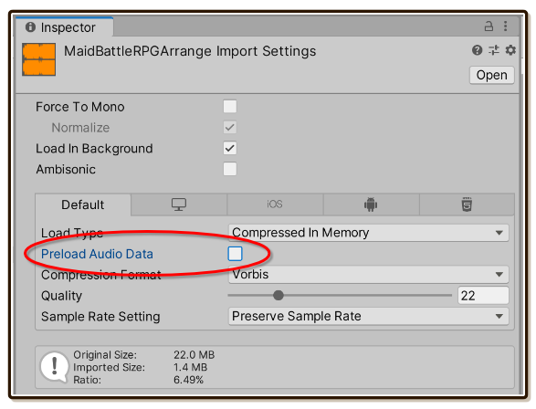

# Audio Import Settings

Pay attention to your `AudioClip`'s import settings. Your `AudioClip` made up the `IntroloopAudio` asset, and the play is fully respecting every import settings you made there.

## Preload Audio Data is not recommended!

I recommend you to **uncheck [Preload Audio Data](https://docs.unity3d.com/ScriptReference/AudioClip-preloadAudioData.html)** for **all** audio you planned to use with Introloop. (Or even without Introloop in general, as long as it is a music not an SFX.) Since if checked, merely having reference to `IntroloopAudio` in any `GameObject`'s inspector slot will cause the audio to be loaded into memory at scene start even if you are not going to play it yet.

This is Unity's default, Unity scans all references in the scene and load all of them at start. Be it texture, `ScriptableObject`, etc. But luckily only for audio we have this checkbox unchecking to prevent it.

For other things, we need to deliberately place them in Resource folder or use the new [Addressable Asset System](https://docs.unity3d.com/Packages/com.unity.addressables@latest), don't have them attached to any inspector slot in the scene, and finally load them via string path of `Resources.Load` or `Addressables.Load`. All these inconveniences just to prevent the auto load. (You can also [read my research](https://gametorrahod.com/unity-texture-memory-loading-unloading-7054819e4ae8) regarding texture memory loading.) Audio is lucky to have this option that natively prevents auto load, you should use it.

Introloop also has some optimized loading logic. It loads only when you call `Play`. It unloads immediately on `Stop`, after a crossfade has ended if any. (Unity's default does not unload an audio on stopping.) If you checked Preload Audio Data, this optimization loading logic will be useless.

Even if you want an audio preloaded to have the fastest start on `Play`, I have also provided `.Prepare()` method that can force the load anytime without playing.

## Load In Background

You can use either one.

- With Load In Background, a `Play` call will be non-blocking and Introloop will properly wait for an audio to fully load before playing at several frames later. (This wait is with a coroutine running on the `IntroloopPlayer`)
- Without Load In Background, a `Play` will be a blocking call. An audio will be surely played in the same frame but the game might lag a bit depending on your audio size and compression settings.

An advanced method `.Prepare()` can force a load so that the next `Play` is more instant.

## Compression and Quality

As advertised, we don't need to physically cut an audio file with Introloop. We could use any compression format we want without fearing the dreaded compression artifacts/offset samples at the edge of waveform ruining the loop. Smash the quality down as much as you like to save space, it will still loop seamlessly. Also you could also resample it down to lower rate to save even more space.

There are cases when then quality is really low and the compression artifacts on the end does not blend well with one at the beginning. (Compression has its own characteristic sound) You can try moving the quality up and down around by 1 or 2, or move the Intro and Looping Boundary forward **by the same amount** for a bit of time. (Don't go over the length of your left over rendered audio after the Looping Boundary.)

## Load Type

Decompressed load and compressed in memory works flawlessly. But there is a slight problem with **Streaming**.

In this mode, Unity's API does not allow a full load. A load command seems to load a very small chunk (the "buffer size" just enought to start streaming). The result is that `Play` starts eagerly while the rest is being loaded at the same time. This might cause **the first loop** to be mistimed and not so seamless if called when your game is busy. Unloading also does not work, but it is not required anyways since with Streaming you are already using a very small amount of memory throughout the play.

To counter this, there is always slight delay offsetted **to the scheduling** on each play. This helps stabilize Streaming load type greatly. The mentioned problem could still occur if the game lags more than this added offset, which is just a bit more than 1 frame of 60 FPS. You can change this in the source `IntroloopTrack.cs > float smallPrepareTime` if you wish.