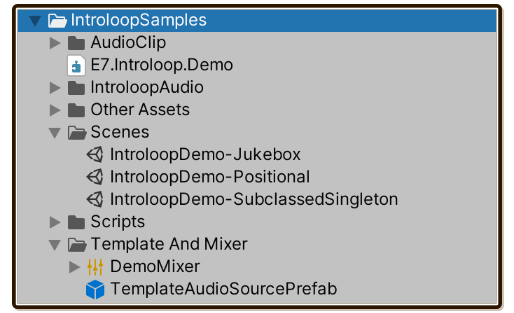
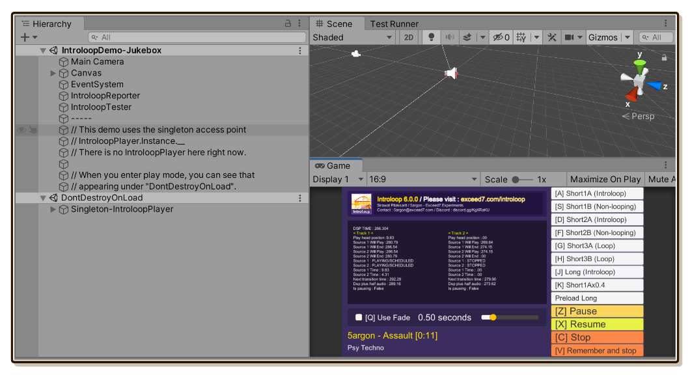
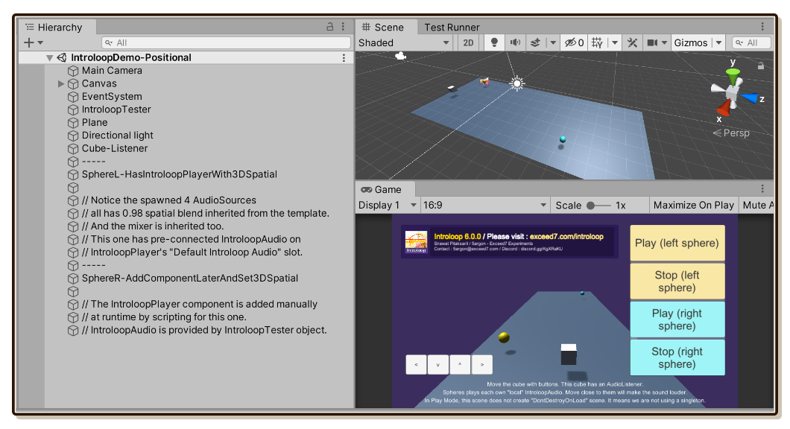
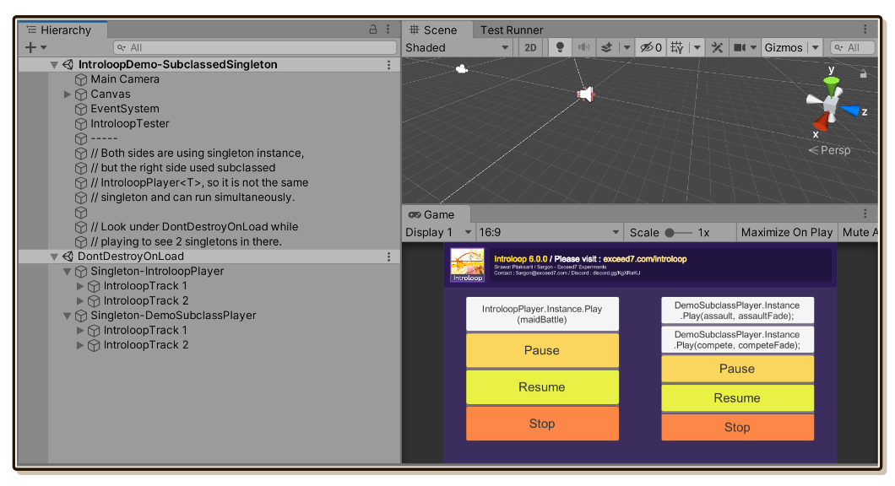

# Demo and Samples

Samples are inside Unity which you can inspect and see how everything connects, which requires a purchase of Introloop since it is included inside the package. Demo is the same Samples but is a **build** so you can download try even without purchasing Introloop.

Available platforms for demo builds are : Windows, macOS, Android (APK), iOS (Xcode Project). Unfortunately, WebGL demo which could have been convenient is not available due to WebGL not supporting schedule methods on `AudioSource`, a core method that Introloop is built on.

## Getting samples

Follow instructions in [Getting Started/Installing](./installing.md) until you unzip `Samples~.zip`. There is a folder inside `Samples~` named `IntroloopSamples`. You can copy it out of `Samples~` into your game so Unity starts importing it.

If you keep going and make it full-UPM, Samples can be imported by pressing "Import" button in Package Manager window while inspecting Introloop entry.

## Structure

There are **3 scenes** in one sample, which share some common resources. Everything is wrapped in Assembly Definition (`.asmdef`) named `E7.Introloop.Demo`, it is linking to `E7.Introloop` to simulate usage from your perspective.

## Scenes

### Jukebox

Call some common public APIs on `IntroloopPlayer` by clicking buttons or pressing keyboard keys, while seeing detailed debug information rapidly updating in real time.

This demo uses the [singleton instance](./introloop-player.md#using-the-singleton-instance) feature, and also using [`SetSingletonInstanceTemplateSource`](./introloop-player.md#setting-template-source-for-the-singleton-instance) to make that instance starts with the correct output `AudioMixerOutput`.

- As a demo :
  - Windows : https://exceed7.com/dl/introloop-demo-jukebox-windows
  - macOS : https://exceed7.com/dl/introloop-demo-jukebox-macos
  - Android (APK) : https://exceed7.com/dl/introloop-demo-jukebox-android
  - iOS (Xcode Project) : https://exceed7.com/dl/introloop-demo-jukebox-ios

### Positional

Buttons can control 2 positional `IntroloopPlayer` in the scene. The left one used pre-connected Default Introloop Audio and pre-connected Template Resource on-scene. The right one has nothing and setup everything at runtime.

You can move the listener object by pressing directional button on the screen. Because all the templates configure underlying `AudioSource` to be 3D, you can hear the audio fades in and out as you move the listener around.

- As a demo :
  - Windows : https://exceed7.com/dl/introloop-demo-positional-windows
  - macOS : https://exceed7.com/dl/introloop-demo-positional-macos
  - Android (APK) : https://exceed7.com/dl/introloop-demo-positional-android
  - iOS (Xcode Project) : https://exceed7.com/dl/introloop-demo-positional-ios

### Subclassed Singleton

This demo shows how to use the special [`IntroloopPlayer<T>`](./introloop-player.md#defining-more-singleton-instances) subclassing, which grants you a new set of singleton instance under any custom name. The proof is that you can hear 2 independent Introloop audio at the same time, and there are 2 game objects under that `DontDestroyOnLoad` scene.

- As a demo :
  - Windows : https://exceed7.com/dl/introloop-demo-subclassed-singleton-windows
  - macOS : https://exceed7.com/dl/introloop-demo-subclassed-singleton-macos
  - Android (APK) : https://exceed7.com/dl/introloop-demo-subclassed-singleton-android
  - iOS (Xcode Project) : https://exceed7.com/dl/introloop-demo-subclassed-singleton-ios