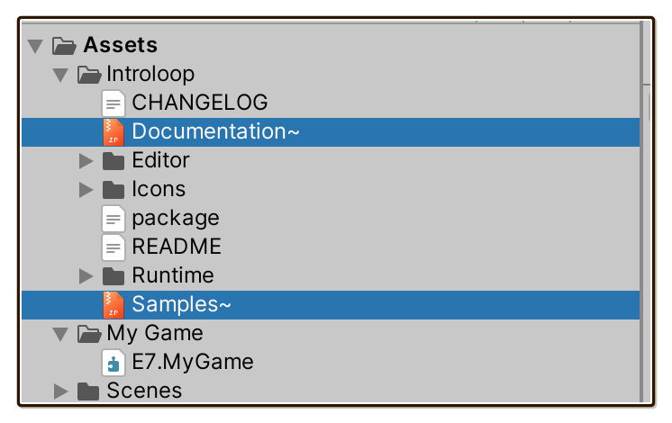

# Installing

The standard of installing Asset Store package today has become installing with Package Manager (**Window > Package Manager**) instead of Asset Store tab.

If you installed Unity official packages from there lately, you will notice that they no longer go to your `Assets` section, but in your `Packages` section instead.

This is because they are Unity Package Manager (UPM) with a proper [package manifest (`package.json`)](https://docs.unity3d.com/Manual/upm-manifestPkg.html). How [Samples](https://docs.unity3d.com/Manual/cus-samples.html) and [Documentation](https://docs.unity3d.com/Manual/cus-document.html) should be included is also standardized.

This is a very modern way of using packages while keeping `Assets` content only your game, much like front end web development where external packages are all in `node_modules`.

## 1. Classic importing install

Introloop is a modern package that is UPM-compatible. But unfortunately, everything from Asset Store is still **installed in the old way** : by pouring everything into `Assets`.

We have to install this way **first**, then optionally, you can keep going to make it beautifully full-UPM, just like all those Unity official packages.

1. Purchase Introloop [from the Asset Store](https://u3d.as/mxD).
2. In Unity, select **Window > Package Manager**. Ensured you are signed in with the same ID you purchased the plugin, then choose **Packages: My Assets** from drop down on the top left. You should find Introloop among those.
  
  

3. Press **Download** and then **Import**. A popup to import will appear. Confirm and `Introloop` folder will be imported into your `Assets`.
  
  

You can now start creating [IntroloopAudio](./introloop-audio.md) assets, or attach `MonoBehaviour` component such as [`IntroloopPlayer`](./introloop-player.md) to use your creations.

For C# scripting, if your game is using [Assembly Definition (`.asmdef`)](https://docs.unity3d.com/Manual/ScriptCompilationAssemblyDefinitionFiles.html) you will need to specify reference to the newly added `E7.Introloop.asmdef` file inside the newly imported `Introloop/Runtime` folder.

## 2. Unzip offline documentation and samples

Unity now has standardized how [Samples](https://docs.unity3d.com/Manual/cus-samples.html) and [Documentation](https://docs.unity3d.com/Manual/cus-document.html) should be included with the package. By naming the folder as exactly `Samples~` and `Documentation~`, Unity will skip importing them (due to [trailing `~`](https://docs.unity3d.com/Manual/SpecialFolders.html)), yet you can access them via your PC's file explorer or even the Package Manager.

Again, unfortunately, Unity's own Asset Store submission tool skips uploading those standardized `Samples~` and `Documentation~` folders. I have to archive them in `Samples~.zip` and `Documentation~.zip` instead as a workwround. **Manually unzip both** with your file explorer to access them.

- **Documentation** is in fact an entire official website, which you can read offline with any Markdown reader. All links and images work just like in the online website.
- **Samples** should be imported into your project **outside** of `Introloop` folder, since they are examples of how to use Introloop from user's perspective.

  Copy the content out of unimporting `Samples~` folder into your `Assets` folder, Unity will import them, then you can open the sample scenes inside.
  
  Each sample is individually wrapped in Assembly Definition (`.asmdef`) that references into `E7.Introloop` assembly to use it, just like you would. More about these samples in [Demo and Samples](./demo-and-samples.md) page.

At this point, you can delete `Samples~.zip` and `Documentation~.zip` to save some space.

## 3. Upgrade to modern UPM install

After you have unzipped `Samples~.zip` and `Documentation~.zip`, now the content of `Introloop` folder follows the [Package Layout standard](https://docs.unity3d.com/Manual/cus-layout.html) exactly.

You now have a chance of taking everything **out of your project** and **reference** it with UPM's `package.json` feature instead.

1. The package right now should be in `YourGame/Assets/Introloop` after you imported it from Package Manager.
  
   Move an entire `Introloop` folder **out of `Assets`**. This can be `YourGame/Packages/Asset Store/Introloop`, for example. It is recommended that the path is short relatively from your project's `Packages/manifest.json` file, and is also still under your game's version control.

   

2. Open **Window > Package Manager** and press the plus `+` button at the top left. Select **Add package from disk...** and browse to where you put `Introloop` earlier. **Select its `package.json` file**.

   

   Your project's `Packages/manifest.json` will change to record this reference. Note that the path is also relative to `Packages/manifest.json`, seeing that it immediately starts with `file:Asset Store` folder we named.

   

Congratulations! You are now a step into the future of Unity. First, the package now appears in **Package: In Project** section of Package Manager. Even better, the blue **View documentation**, **View changelog**, and **Samples** section down below also works. (Because you unzipped `Documentation~.zip` and `Samples~.zip` earlier, making the result conforms to UPM standard.)

  

Moreover, Introloop now cleanly stay put in `Packages` section instead of `Assets`. Assembly Definition link crossing from `Assets` to `Packages` works.

  

## 4. Finishing touches

This is yet another optional step to bling up your install even further than UPM-referencing. I am all-in for the package ecosystem, so I would like to share some awesome tips here!

### Packing into tarball

When you look in your version control, a lot of files from Introloop appears as new additions. This is also the case for all classic Asset Store install.

We can make it better by **packing the package** and then use **Add package from tarball...** under that plus `+` button instead. Now Introloop updates in your version control under only 1 entry!

Unity's `package.json` follows the same standard as [npm](https://www.npmjs.com/). We can borrow npm's packing command for this task.

1. Ensure your terminal can use `npm` by [installing it](https://www.npmjs.com/).
2. Go to the `Introloop` folder where its `package.json` is using your terminal.
3. **Run `npm pack`**. It will produce a file named like this `com.e7.introloop-6.0.0.tgz`. You can now delete everything else, including the `Documentation~` and `Samples~`. They are all packed in `.tgz`.

   

4. Use **"Add package from tarball..."** under that `+` drop down instead of "Add package from disk...". Everything should work the same, except your version control is much cleaner. Editor like JetBrains Rider even could follow the code into the `.tgz` and edit the innards!

   

### Serving the package for multiple projects

Perhaps you are developing multiple games, or a single game that is divided into multiple smaller Unity projects, or just want everyone in the company to be able to use the tarball from a shared directory.

A step further than that would be referencing that `.tgz` you made from multiple projects, so anytime you update the package, it is reflected in all projects. (You still have to follow Asset Store EULA of your purchase, which is licensed **per seat**.)

To do that, you may have brittle local path problem because all projects must now travel from `Packages/manifest.json` to central location somewhere in your PC. 

The right way to do this is to **run your own package registry**. This is now out of scope of this documentation, but I just want to mention that my packages are possible to be organized that way, because they are in UPM-format.

- See the official [Scoped Registries](https://docs.unity3d.com/Manual/upm-scoped.html) documentation.
- See how [OpenUPM](https://openupm.com/docs/#how-it-works) did it for better understanding. I also have open source UPM packages hosted there such as [Notch Solution](https://exceed7.com/notch-solution). I am excited by the future of packaged development in Unity.