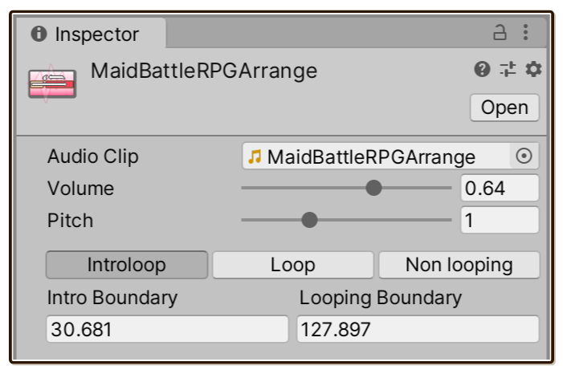

#  `IntroloopAudio`

We will create one `IntroloopAudio` asset file (a `ScriptableObject`) per each music you would like to play.

## Creating `IntroloopAudio`

**Right click inside Project pane** then **Create > Introloop > Introloop Audio**.

You will use this `IntroloopAudio` asset instead of original `AudioClip` as an input to the [`IntroloopPlayer`](./introloop-player.md), which replaces `AudioSource`.

## Connect `AudioClip` reference

Inspect your new `IntroloopAudio` asset and connect your `AudioClip` to the asset reference box.

`IntroloopAudio` is not replacing `AudioClip`, just referencing it. You can and should adjust import settings on your `AudioClip` as you see fit.

## Enter the boundaries

Enter the **Intro Boundary** and **Looping Boundary** time value you got [earlier](./preparing-the-music.md). Unit is **in seconds**. Unity's default floating point editor allows precision up to 3 points.

You can also set a default volume here which is convenient for balancing music level, since normally Unity cannot store playback volume information in the `AudioClip` directly. You can also set a **constant** pitch modification that applies on play.

> [!WARNING]
> Unlike `AudioSource`, you cannot change pitch dynamically while playing, since that would wreck the precise scheduling required to perform looping stunts.

There are 3 playback modes to choose from, which you can set **per `IntroloopAudio`**.

- The **Introloop** mode is the main attraction of this plugin. It loops from somewhere in the back to somewhere in the front, not necessarily at the very beginning and the very end.
- **Loop** and **Non looping** is for playing like Unity normally did with `loop` checked and unchecked in `AudioSource` respectively.

  For these 2 modes the boundaries is ignored. They exist for interoperability with introlooping audio. For example, you can crossfade from introlooping audio to a non-looping audio.
  
  You also gain Introloop features unrelated to looping, such as automatic audio unloading, volume per music, etc. You can use the same API set to play all your music whether introloop or not, which may simplify your C# code instead of having both `AudioSource` way and `IntroloopPlayer` way at the same time.

## Next step

Now that you have got your music setup in `IntroloopAudio`, it is time to play! We use a `MonoBehaviour` component called `IntroloopPlayer` for this. Head to [Getting Started/IntroloopPlayer](./introloop-player.md) next.