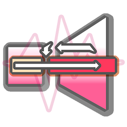
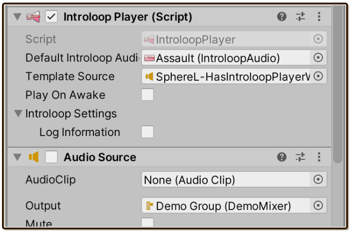
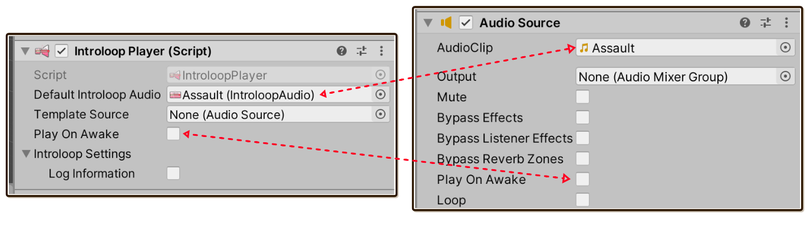
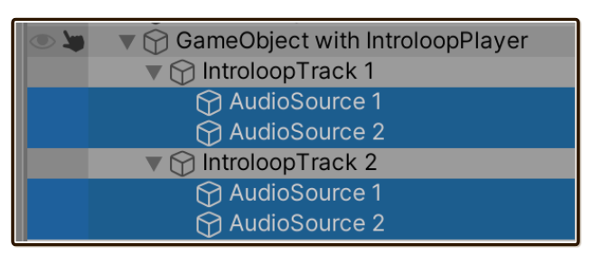
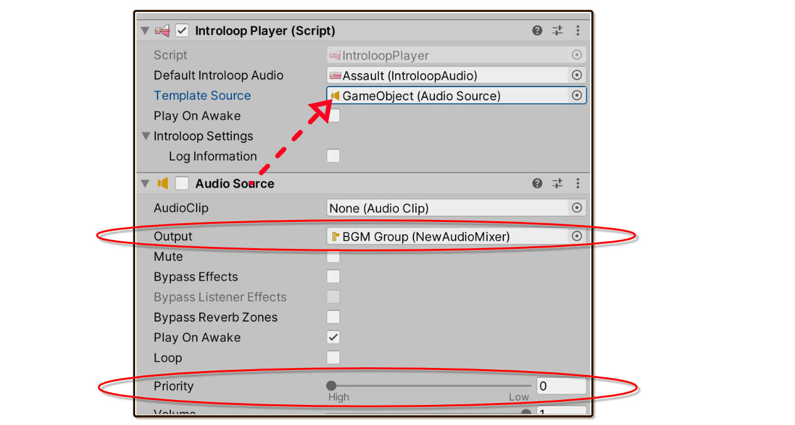
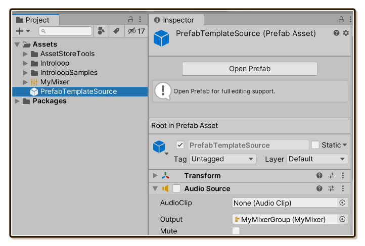
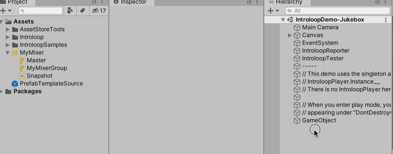
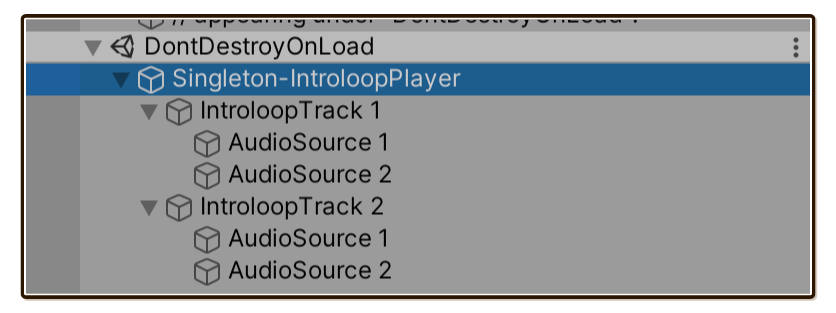
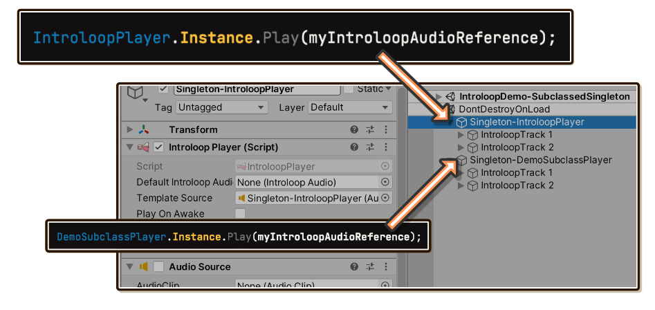

#  `IntroloopPlayer`



In Unity, `AudioSource` takes an `AudioClip`. In Introloop, `IntroloopPlayer` takes an `IntroloopAudio`. If you have used `AudioSource` to play music before, it works very similarly.

> [!TIP]
> C# Scripting API are all in the namespace `E7.Introloop`. Make sure you have already link up the [Assembly Definition Files (asmdef)](https://docs.unity3d.com/Manual/ScriptCompilationAssemblyDefinitionFiles.html), to Introloop's `E7.Introloop` as explained in [Getting Started/Installing](./installing.md)

## Basic playing : Similar to `AudioSource`

Remember that in `AudioSource`, you can connect `AudioClip` to the "AudioClip" slot in Inspector. Then either checking "Play On Awake" and enter Play Mode, or call `Play` in the scripting API to play a clip connected to that slot.

It is also possible to set the `AudioClip` into `clip` property before calling `Play`, making it a 2-step process of assigning and playing `AudioClip` entirely from script.



Similarly, `IntroloopPlayer` provides "Default Introloop Audio" exposed Inspector field to parallel "AudioClip". It also has the same "Play On Awake". And also `DefaultIntroloopAudio` for use in scripting to parallel `clips`.

Here is an overview of all `public` API, which we will revisit later in this page. The first 2 `Play` will use `IntroloopAudio` you connect to `DefaultIntroloopAudio`.

```csharp
Play():void
Play(float fadeLengthSeconds, float startTime):void

Play(IntroloopAudio introloopAudio, float fadeLengthSeconds, float startTime):void
Play(IntroloopAudio introloopAudio):void

Stop():void
Stop(float fadeLengthSeconds):void
Pause():void
Pause(float fadeLengthSeconds):void
Resume(float fadeLengthSeconds):void

Seek(float elapsedTime):void

Preload(IntroloopAudio introloopAudio):void
GetPlayheadTime():float
SetMixerGroup(AudioMixerGroup audioMixerGroup):void
ApplyAudioSource(AudioSource applyFrom):void
```

## The template source

It is time to learn about how Introloop stitches your audio under the hood.

Actually, Introloop manages your music using **4 `AudioSource`**. You can see them clearly under the game object that has `IntroloopPlayer`. All these are working together to output a single music you are playing on `IntroloopPlayer`! 



Because these are automatically spawned at runtime and does not exist at edit time, I have to provide some way to configure properties on all 4 `AudioSource`, some very important one including Priority (should be high, so music cannot be cut off by sound effects.) and Output `AudioMixerGroup`. You can do so with the "Template Source" feature.

By creating `AudioSource` anywhere (can be right next to `IntroloopPlayer` component) and connect the reference to this slot, it will propagate almost every settings into all 4 `AudioSource`. This template `AudioSource` can be **disabled** (uncheck the box on the component's header), since it exists only for its fields to be copied.



You can configure it however you like. But here are some popular settings you probably want :

- Output `AudioMixerGroup` : You probably want your introlooping music to go into "BGM" mixer of some sorts, so that can be linked in BGM slider in your option screen, for example. In the end this means **all** 4 underlying `AudioSource` are all outputting to the same mixer.
- Priority : Should be 0 (= high priority) to prevent your music from being stopped when there are many audio playing in the scene. All the SFXs should be at higher priority number (= low priority) so it cut its own kind out instead of music.
- Spatial Blend : Should be full 2D for background music, which is the default. However, in the case that you want Introloop playing on a radio on the table, and have it fades in as the character walks into it, then you can set the blend to 3D along with other spatial features here such as the falloff curve.

> [!WARNING]
> "Pitch" is ignored. You can only play with pitch by setting it on each `IntroloopAudio` you want to play, and it must be constant. This is because pitch is related to audio length and Introloop's scheduling accuracy is sensitive to length.

### Template source from a prefab asset

This trick maybe is even better than attaching the template `AudioSource` right next to `IntroloopAudio` component.

Instead, create a **prefab** asset that only have `AudioSource` (and `Transform`) on it. Setup the `AudioSource` as you like to be the template , such as connecting with output `AudioMixerGroup`.



Then drag that prefab (the blue box) all the way from Project panel to the Template Source slot in the Inspector panel. The slot would still find `AudioSource` component in the prefab, displaying the orange speaker icon.



This is convenient because you now have a place in your Project independent of any scene to come to adjust your template source to affect an entire game.

### Automatically spawned template source

When this field is not assigned, when you enter Play Mode, it spawns a disabled `AudioSource` component next to `IntroloopPlayer`, then also connect a reference of that to "Template Source" slot anyways.

This automatically spawned template source has Priority 0 (high) and 2D spatial blend as a default. But it cannot guess which `AudioMixerGroup` output you want to use. You should not rely on this automatic template source.

## Using the singleton instance

While using it like `AudioSource` is easy to understand using your prior knowledge, `AudioSource` is designed to be flexible and generic. Other than playing music, you could play sound effects, or play positional ambience loop on your tree models. (By the way, my other audio plugin [Tiny Ambience](https://exceed7.com/tiny-ambience) probably beats `AudioSource` in doing that. Just saying!)

Instead of being flexible, Introloop is often used for a specific purpose of playing background music (BGM).

- There is only 1 BGM playing in most games, which change or crossfade songs according to situations, or having lowered volume while in menu. This means you always want this 1 instance of `IntroloopPlayer` at hand on many code locations instead of having to declare `[SerializeField] private IntroloopPlayer centralBgmPlayer` everywhere you want to control the BGM.
- Music should be still playing while changing scene, or while in Now Loading screen. In most cases, you want this instance to have `DontDestroyOnLoad` applied.
- You want to route the output of this instance to your "BGM" `AudioMixerGroup`, and having Priority 0 (high). 

The class `IntroloopPlayer` has a special singleton instance with all of above's requirements waiting for you! Go from having to do this :

```csharp
[SerializeField] private IntroloopPlayer theOnlyOneBgmPlayer;
[SerializeField] private IntroloopAudio myMusic;

public void Start() {
	theOnlyOneBgmPlayer.Play(myMusic);
}
```

To this : 

```csharp
[SerializeField] private IntroloopAudio myMusic;

public void Start() {
	IntroloopPlayer.Instance.Play(myMusic);
}
```

By calling a `static` property `IntroloopPlayer.Instance` for the first time, it automatically spawn `IntroloopPlayer` with `DontDestroyOnLoad`, then that property give you back the `IntroloopPlayer` to you. Any other calls will get you **the same instance**. Now you can control your BGM from anywhere in the code easily!

This is how the singleton instance looks like in Hierarchy : 



### Setting template source for the singleton instance

Being able to call a convenient `IntroloopPlayer` out of thin air is great and all, but now we can no longer use the Template Source feature. How can we setup something like output `AudioMixerGroup` now?

**Before the first access** to `IntroloopPlayer.Instance`, you can call a special <c>static</c> method that store a template source which the singleton instance could pick up on the first instantiation : `IntroloopPlayer.SetSingletonInstanceTemplateSource(templateSource)`.

```csharp

// Supposed that this template source has output AudioMixerGroup assigned.
[SerializeField] private AudioSource templateSource;
[SerializeField] private IntroloopAudio audioToPlay;

public void Awake() {

	// Must call before the first access.
	IntroloopPlayer.SetSingletonInstanceTemplateSource(templateSource);

	// Spawned singleton instance under DontDestroyOnLoad now spawned with
	// applied settings from the template source!
	IntroloopPlayer.Instance.Play(audioToPlay);
}
```

If you somehow can't do it before the first play, calling `ApplyAudioSource` on the singleton instance can also later apply any `AudioSource` fields to the currently running 4 `AudioSource`.

### Defining more singleton instances



You may want **an another** singleton instance other than just 1 given by `IntroloopPlayer.Instance`.

For example, you would like a singleton `IntroloopPlayer` dedicated to field music called `FieldMusicPlayer.Instance`, and an another for battle music called `BattleMusicPlayer.Instance`. Be it for organizational purpose, or you really want multiple overlapping Introloop musics playing at the same time. And you want the convenience of the singleton instance for all of them.

There is a special class called **`IntroloopPlayer<T>`**, instead of just `IntroloopPlayer`. Not only it has generic variable `T`, it is also an `abstract` class. So it must be subclassed to be useful.

It uses C# trick which is when a class is generic, different permutation of input generic type will produce a new set of `static` variables. `IntroloopPlayer<T>` is designed so you can just throw the name of your subclass **itself** into that `T`, making the `static` it give you always a new one under your own class name.

To get `FieldMusicPlayer.Instance` and `BattleMusicPlayer.Instance` that leads to a different singleton than `IntroloopPlayer.Instance` (so you now have 3 singletons), define empty subclasses like this :

```csharp
    internal class FieldMusicPlayer : IntroloopPlayer<FieldMusicPlayer> {
    }
```

```csharp
    internal class BattleMusicPlayer : IntroloopPlayer<BattleMusicPlayer> {
    }
```

By putting the class **itself** into generic variable like this, the code is able to return **typed singleton instance** `T` from `.Instance` instead of just `IntroloopPlayer`. You can get creative with this by coding something more into this empty class.

When you start using them, in the Inspector you can clearly see under `DontDestroyOnLoad` scene that they are different singletons running at the same time.


## Scripting API

```csharp
Play():void
Play(float fadeLengthSeconds, float startTime):void

Play(IntroloopAudio introloopAudio, float fadeLengthSeconds, float startTime):void
Play(IntroloopAudio introloopAudio):void

Stop():void
Stop(float fadeLengthSeconds):void
Pause():void
Pause(float fadeLengthSeconds):void
Resume(float fadeLengthSeconds):void

Seek(float elapsedTime):void

Preload(IntroloopAudio introloopAudio):void
GetPlayheadTime():float
SetMixerGroup(AudioMixerGroup audioMixerGroup):void
ApplyAudioSource(AudioSource applyFrom):void
```

Most `public` API you can call are straightforward.

- `Play` overload with `IntroloopAudio` argument will not care the "Default Introloop Audio" slot, instead use any reference to `IntroloopAudio` you provided. This is some difference from `AudioSource`'s API.
- Notably, many provided `fadeLengthSeconds` which is seemingly "fluff" argument usually not present in audio scripting API. Introloop gets very complicated when fading out due to internally maintained 4 `AudioSource`, and gets more complicated when you want to unload the audio afterwards, but wait for the fade out to be done first. It is better than the plugin provide this functionality for you.
- Starting `Play` again with new audio and also with `fadeLengthSeconds` provided will **cross fade** audio.
- `GetPlayheadTime` is used to remember the time for use with `startTime` argument. Note that "play head time" is not elapsed time. It accounts for the "introloop" behaviour already. (i.e. The "play head" never come back to before the intro boundary again after passing it.)
- `ApplyAudioSource` is used to perform similar to the Template Source, but at any later time. `SetMixerGroup` is a subset of `ApplyAudioSource`, chaging only output `AudioMixerGroup` and not touching anything else.

