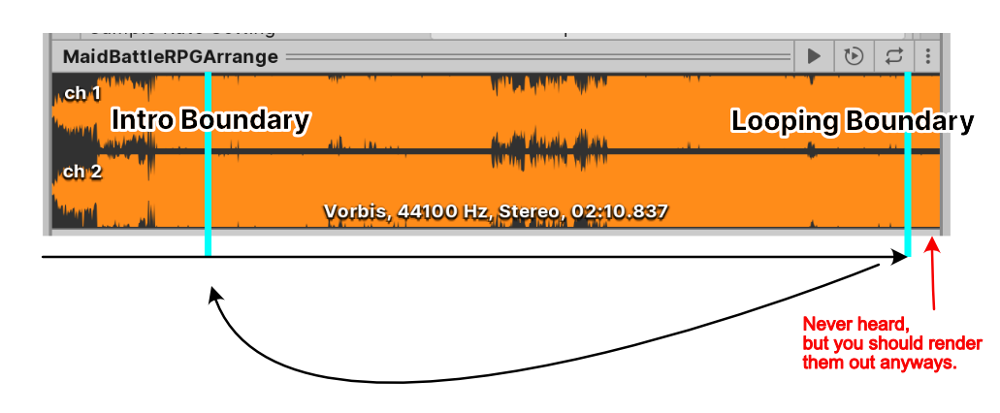
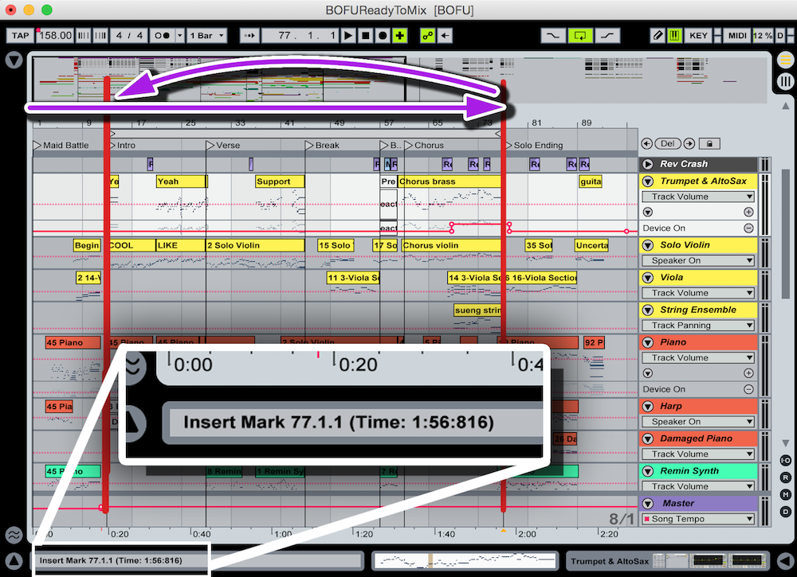
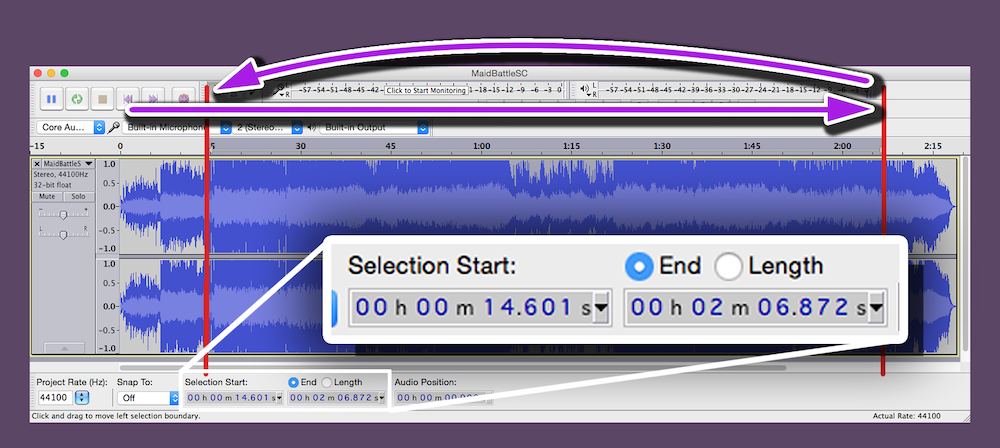

# Preparing the music

For each music with intro section you would like to use with Introloop, you need 2 time points :

- The first point is called **"Intro Boundary"** which is the point that separates an intro from the rest of the song.
- The 2nd point is **"Looping Boundary"**. When the playhead arrives at this point it will go back to Intro Boundary.

By these definitions :

- The audio bits after both boundaries should sound exactly the same.
- The audio after Looping Boundary will never be heard if Introloop works perfectly.
- So technically the Looping Boundary is useless as it will always be at the very end of audio file. *However* it is recommended to have a bit more audio (~1s) after that just in case the schedule fails to meet.

  

### From the music composer

If possible you should ask these point directly from your composer, since in the Digital Audio Workstation (DAW) there is a beat grid to snap to and it is a sure fire way to get the exact time!

Introloop is also natural for the composer. Almost all DAW has a "loop bracket" function. You can start playing before the left edge of the bracket, but once the playhead is inside and finally arrives at the right edge then it loops back to the left edge.

Introloop make the composer very comfortable as he see what the game would play like what he can preview on the DAW. Exporting the song is easy as he can export the whole song without any special care like having to export twice to cut them up for the developer.

If possible please tell the composer to compose **a bit more to the right** of looping point (about 1 second is fine) and render those out too. This is the only special care Introloop needs, but most of the time when scheduling works they won't be heard.

### If you can't contact the composer

In this situation you can use a free program like [Audacity](http://audacityteam.org) to find the Intro and Looping Boundary by yourself.

Timing might be difficult since there is no snap, but zooming closely to the waveform you should see a meaningful transient that you can match. [There is an article from the Audacity team of how to make a looping audio](http://manual.audacityteam.org/o/man/tutorial_looping.html). If you follow the guide and successfully cut a looping part, you have already got 2 time points required for Introloop which is the begining and end point that you cut.

## Next step

Import that music into Unity to get `AudioClip` like usual. Next, you will create an asset file called `IntroloopAudio` that can take a reference of your `AudioClip` and several more data about the looping points. Head to [Getting Started/IntroloopAudio](./introloop-audio.md) next.