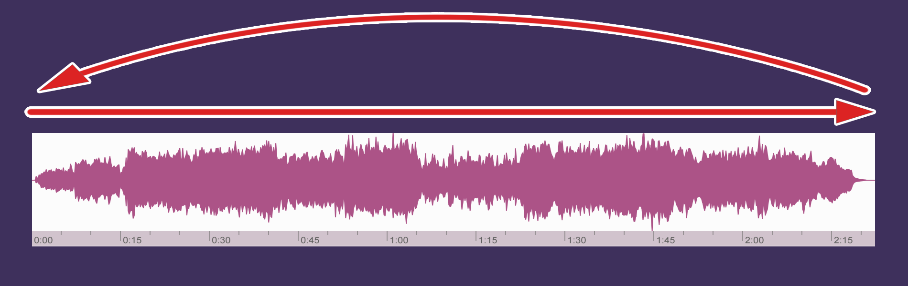
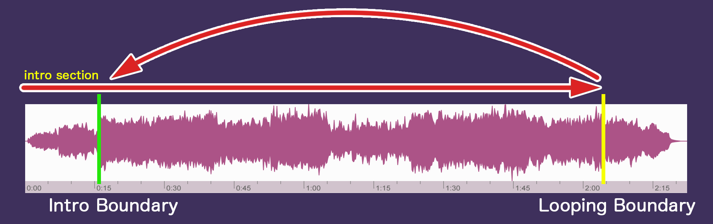
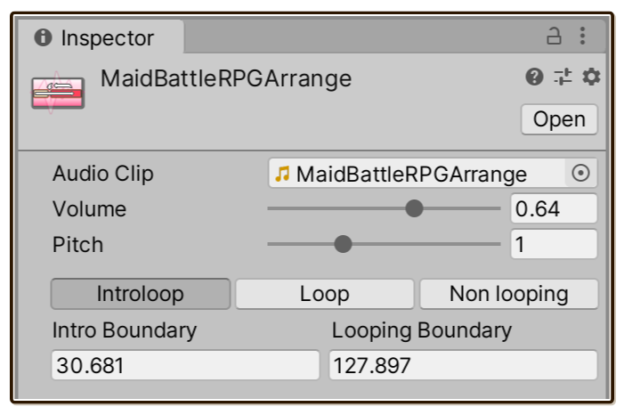

> [!WARNING]
> Requires Unity 2019.4 LTS or newer. Not supported on WebGL, due to unusable/faulty `PlayScheduled` and other scheduling methods. (Despite the documentation [says it is supported](https://docs.unity3d.com/Manual/webgl-audio.html), it is not.)

Less than 1 minute video explanation of what it is

> [!Video https://www.youtube.com/embed/M44wGGPB11k]

<blockquote>
Get that charm of a polished game. Adds huge value to music. Directs player's feel with an intro. Gives every song a memorable and immersive feeling which can't be put in an OST.
</blockquote>

## Make a difference with your background music

In Unity if you select "Loop" in `AudioSource`, the song will loop to the beginning when it reaches the end of file. This is simple, but is also sample-accurate seamless.

With **Introloop**, you can specify 2 time points **"Intro Boundary"** and **"Looping Boundary"** in your audio.

Playing your audio with this plugin will loop back to Intro Boundary when it reaches Looping Boundary, effectively make the section before Intro Boundary **an intro section that plays only once** and the rest will be looping.

Those two points of time are stored in an asset file called `IntroloopAudio`, which has a reference to your original audio file (`AudioClip`). You play `IntroloopAudio` on `IntroloopPlayer` which replaces the typical `AudioSource`. It knows how to loop to a different point.

This `IntroloopPlayer` class also comes with a special `static` accessor that go straight to `Play` like : `IntroloopPlayer.Instance.Play(myIntroloopAudio)`. It automatically instantiate and maintain `IntroloopPlayer` singleton inside `DontDestroyOnLoad` for you, as I expected most games would want a single instance to run the BGM.

Your original audio file will remains intact. There is no need to cut it up to 2 files like some other solutions. Updating songs from your composer is as easy as overwriting the audio file. As long as the song structure doesn't change, your `IntroloopAudio` will still works.

## Why is this necessary?

It is a common practice used in many commercial games. Intro adds huge value to music, turning into a powerful tool for directing player's feel and blends more into gameplay.

Maybe if you haven't noticed this before, in this section I will show various examples from games I liked.

Let's recall memorable moment from favorite games you have played. A destined fight with arch rival? Roaming over world map for the first time? An opening stage that really hooks you that you can't put down the joystick?

Wondered why they stuck so well in your memory?

Many commercial game music has certain charm when you are listening to it **in the game** because they have been **programmed** to have a nice intro that sets the mood of that particular scene before transitioning seamlessly to a music loop, never having to play the intro again.

This is the source of immersive feeling you never get when you listen to the song again in an OST or YouTube. You must experience it in the actual game. It passively make the song catchier, and it is less mundane on repetitive scenes too when the game design requires some grinding.

### [Final Fantasy](#tab/ff)

> [!Video https://www.youtube.com/embed/wNkNTdPL7A8]

RPG gamers knows the "random encounter". In theory it may get really boring after a while, but it works so well and always so exciting partly because of music's intro that really tell you "let's fight!" but at the same time never loop to that intro again, keeping the intro powerful and fresh on every new fight.

Intro also make the music more memorable, as the player heard the intro he/she will be subconsciously already preparing to hum to the verse.

### [Pokemon](#tab/pokemon)

> [!Video https://www.youtube.com/embed/UNcuZ9PhVtA]

When you run into some wild pokemon or even trainers, the spiraling iconic intro has been meticulously timed with the visual that warps you into the battle. From there an epic melody or some sick bassline will really shine.

This part is never repeated again in a fight. It is one of the iconic thing in Pokemon. Without it Pokemon would not feel the same.

### [Lengthy fight](#tab/lengthy-fight)

> [!Video https://www.youtube.com/embed/0ZF9-1jd8u4]

A solution for lengthy fight. In situation like the final boss fight or even normal "fight" in a tactical turn-based RPG game, perhaps the music will loop multiple times.

Why not begin with something a bit different? Music in this example is quite long, nevertheless when it reaches loop point you will see that if you have to begin the song at that point it would not be as effective.

### [Small intro](#tab/small-intro)

> [!Video https://www.youtube.com/embed/M3zXV7BbD-s]

Add shines to any track even with shortest of intro. Small difference, but it reflects your attention to details.

You don't have to think of "Intro" as a long musical passage. Merely single-melody synth stab or one bar of attention-grabbing rhythm at the song's start can dramatically add memorable cue and makes player come back for more.

This technique also can be used in scene that will be visited often like character select screen in fighting game. Think the same why you put your time to animate your UI sliding in everywhere before allowing your player to interact them, because the payoff in UX is huge. It is the same for music.

### [Mood transition](#tab/mood-transition)

> [!Video https://www.youtube.com/embed/rA9d195pKZU]

How about a menacing tone at the start and then picking up the tension later?

In normal looping your composer would have to find a way to reduce the tension again in order to seamlessly loop the music.

With Introloop you can give your composer a lot more creativity freedom. Even tempo difference is possible - slower BPM only at start, increase speed later and never loop back to that part again.

### [Not just battle](#tab/not-just-battle)

> [!Video https://www.youtube.com/embed/Kee6LWyQZ8I]

An opening stage with epic begin, a field music that starts with worldly intro, or how about conveying feel of ease when finally arriving at the village with some gentle melody?

It's not just about battle, any feeling that you would like your player to feel, use music intro to direct him/her to that direction right from the start then keep it going with your gameplay.

Especially if those opportunity is rare to come by like an opening stage or rival fight that only occurs 3 times throughout the story, let's make them the best memory for your players.

***

### So basically...

Your tune (and in turn, your game) will be much more memorable and less boring. Exaggerate certain feel in your scene more by incorporating a song intro into the design.

Actually I'm surprised that I haven't seen any audio plugin doing this, something so prevalent on commercial games. It's about time to appreciate the intro.

## Advantages

- **No need to cut the actual file into 2 parts.**
- Because of that you can use **any compression** (like OGG) without fear of messing the precision at the head and tail of audio file. Feel free to utilize the Unity's compression quality slider - and any other audio settings built-in. It even works with `Streaming` load type.
- It is easy to experiment and adjust the loop point right in Unity. In a splitting clips solution you will have to cut the music over and over again until it is seamless enough.
- Updating music from your composer is easy, as long as the song structure is the same you can just replace the whole music and use the old boundaries.
- **Automatic audio memory releasing** at appropriate time. Perfect for mobile project. This is not the case in Unity as even after the song has stopped it will be still in your RAM.
- Supports pause, resume, fade in, fade out and even cross fading between introlooping audio.
- Built in pop/clicks reduction when stopping the music suddenly.
- An asset-based design allows you to have more metadata **per audio**, such as a default volume. This is not possible in an imported `AudioClip`.
- Supports time operation such as seeking or starting at a different time. Note that in Introloop the time is theoretically infinite. These operations are more complex than same thing you usually see in other audio API.
- You could specify a constant pitch for each asset file. The loop scheduling is still dead-accurate.
- Route the entire plugin to your game's `AudioMixerGroup` for your own higher level control. Casting epic spell and wanted to duck the BGM down? Just route to your mixer and use Unity mixer's ducking feature on it.
- Modern plugin design. It is in a proper UPM (Unity Package Manager) shape with `package.json`, with a proper Assembly Definition Files, namespaced properly, `internal` utilized effectively, asset-based design will not clutter your scene with anything, and it came with no other assortments of audio features.
- The license purchase came with full source code.

## Learn more

Start from [Getting Started/Installing](./getting-started/installing.md) then learn how to play your first Introloop in [Getting Started/Preparing the music](./getting-started/preparing-the-music.md).